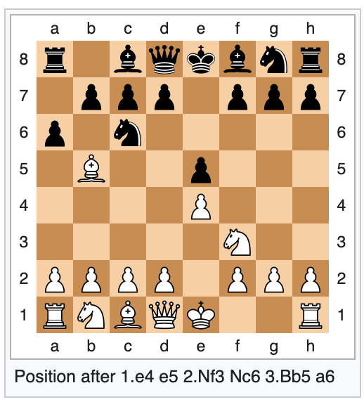

# Xadrez

Christiano Braga
Compiladores 2020.2

Primeiro trabalho computacional
Data de entrega: 05/03/21

Forma de entrega: GitHub Classroom

## Introdução 

Um jogo de xadrez pode ser descrito textualmente utilizando a notação
algébrica descrita em
https://www.fide.com/FIDE/handbook/LawsOfChess.pdf, páginas 18 a 20.

O tabuleiro é representado por uma matriz de 8 linhas, ou _files_ (identificadas
por números de 1 a 8) e 8 colunas, ou _ranks_ (identificadas por letras de 'a' a
'h').

As peças são representadas, essencialmente, pela primeira letra do seu
nome em Inglês:  K=king, Q=queen, R=rook, B=bishop, N=knight. O peão
é identificado pela ausência de uma letra num movimento.

A dinâmica do jogo é codificada por *movimentos* ou *capturas*. Um
exemplo de movimento é `Be5`: bispo para posição `e5`. Um exemplo de
captura é `Bxe5`: bispo captura a peça na posição `e5`. 

## Objetivo

Desenvolva um programa que leia um jogo descrito em notação
algébrica e imprima o tabuleiro resultante.

Por exemplo, a entrada

```
1. e4 e5 
2. Nf3 Nc6 
3. Bb5 a6
```

deve produzir o tabuleiro em



## Instruções

1. Implemente um analisador léxico para a notação algérica em
   https://www.fide.com/FIDE/handbook/LawsOfChess.pdf, páginas 18 a
   20, utilizando o analisador léxico do pacote PLY de Python 3, e
   nomeie-o `xadrez.py`.
   - Pense nos lexemas a serem produzidos e qual informação deve ser
     colocada nos lexemas.
   
1. Implemente um programa `driver.py` que:

   a. Leia um arquivo com a descrição de um jogo de xadrez em notação
	  algébrica;
	  
   b. Invoque o analisador léxico da notação algébrica para xadrez com
	  uma string contendo uma descrição algébrica.
	  
   c. Implemente um função `simula` que dado um lexema modifica a
	  representação do tabuleiro de xadrez como uma matriz, como
	  ilustrado abaixo.
	  
   d. Imprima o tabuleiro resultante utilizando caracteres unicode
      para peças de xadrez descritos em
      https://en.wikipedia.org/wiki/Chess_symbols_in_Unicode.
	  
1. Utilize o pacote `pytest` para testar sua implementação. 

   a. Por exemplo, o jogo vazio deve produzir o tabuleiro:
      ```
	  [[r, n, b, q, k, b, n, r],
	  [p, p, p, p, p, p, p, p],
	  [],
	  [],
	  [],
	  [],
	  [P, P, P, P, P, P, P, P],
	  [R, N, B, Q, K, B, N, R]]
	  ```
   onde as letras minúsculas denotam as pedras pretas e as maiúsculas
   as brancas. 
   
   b. O lexema associado à string `e4 e5` deve produzir o seguinte tabuleiro:
      ```
	  [[r, n, b, q, k, b, n, r],  
	  [p, p, p, p,  , p, p, p],  
	  [],  
	  [ ,  ,  ,  , p,  ,  ,  ],  
	  [ ,  ,  , P,  ,  ,  ,  ],  
	  [],  
	  [P, P, P,  , P, P, P, P],  
	  [R, N, B, Q, K, B, N, R]]  
	  ```
	  
   c. A função `simula*` quando aplicada à uma _lista_ de lexemas deve
      produzir o tabuleiro resultante da execução dos movimentos
      associados a cada um dos lexemas, sequencialmente.
      O jogo
      ```
	  1. e4 e5 
	  2. Nf3 Nc6 
	  3. Bb5 a6
	  ```
	  produz uma lista de lexemas que produzem o tabuleiro abaixo.
	  ```
	  [[r, , b, q, k, b, n, r],
	  [ , p, p, p,  , p, p, p],
	  [a,  , n,  ,  ,  ,  ,  ],
	  [ , B,  ,  , p,  ,  ,  ],
	  [ ,  ,  ,  , P,  ,  ,  ],
	  [ ,  ,  ,  ,  , N,  ,  ],
	  [P, P, P, P,  , P, P, P],
	  [R, N, B, Q, K,  ,  , R]]
	  ```


